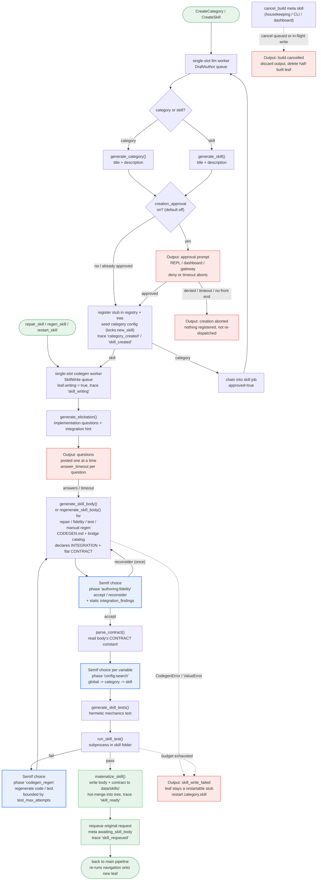

# Input → Output flow

How one input travels through the agent. Every diamond marked **SemIf** is a
real decision-engine call that is logged as a training row; the LLM only ever
*generates* (skill drafts, bodies, questions). There is no up-front
handle/ignore gate — every input is dispatched, and an explicit housekeeping
command is routed deterministically before navigation.

The diagram is split in two: the **main pipeline** (intake → dispatch →
navigation → run → output) and the **authoring pipeline** (what happens when
navigation decides a category or skill does not exist yet). Authoring is
asynchronous: the main gate is freed immediately and the original request is
re-queued once the body lands.

Rendered SVG: [flow-main.svg](flow-main.svg) · [flow-authoring.svg](flow-authoring.svg)

---

## Main pipeline

```mermaid
flowchart TD
    IN["Input<br/>REPL text · gateway DM (SimpleX · LXMF · voice) · dashboard submit"] --> SUB["Scheduler.submit_request()<br/>create Request, trace 'submit'"]

    SUB --> BUSY{"current process?"}

    %% ---------- idle path ----------
    BUSY -- "idle" --> META{"parse_meta_command()<br/>explicit housekeeping command?"}

    %% ---------- busy path ----------
    BUSY -- "busy" --> PUSH["RequestQueue.push<br/>FIFO, bounded"]
    PUSH -- "full" --> REJECT["Output: rejected<br/>'queue is full'"]
    PUSH -- "ok" --> QUEUED["Output: queued"]
    QUEUED -. "run_queue when idle" .-> META

    %% ---------- dispatch ----------
    META -- "yes" --> HK["run housekeeping leaf<br/>trace 'meta_command'<br/>deterministic; skips navigation"]
    HK --> RUN["_run_skill()<br/>execute the leaf"]
    META -- "no" --> NAV["navigate()<br/>descend tree, one SemIf choice per level"]

    %% ---------- actionability guard (top of navigation) ----------
    NAV --> ACTG{"SemIf choice<br/>phase 'navigate:actionability'<br/>P non_action >= action_tau?"}
    ACTG -- "non-action" --> CANNEDLEAF["_navigate_canned<br/>phase 'navigate:response'<br/>closed canned reply tree"]
    CANNEDLEAF --> RUN
    ACTG -- "request" --> CAT["SemIf choice<br/>phase 'navigate:category'<br/>options = real categories +<br/>descriptions + create_category"]

    %% ---------- category selection ----------
    CAT --> CATWIN{"create_category win<br/>or no categories?"}
    CATWIN -- "yes" --> CREATECAT["CreateCategory"]
    CATWIN -- "no" --> CATCONF{"winner prob >=<br/>softmax_bypass_tau?"}
    CATCONF -- "yes (decisive)" --> HASSKILLS
    CATCONF -- "no (unsure)" --> CATFIT["SemIf choice<br/>phase 'navigate:category_scope'<br/>P covers >= category_tau?"]
    CATFIT -- "rejected" --> CREATECAT
    CATFIT -- "covers" --> HASSKILLS

    %% ---------- leaf selection ----------
    HASSKILLS{"skills in category?"}
    HASSKILLS -- "none" --> CREATESKILL["CreateSkill"]
    HASSKILLS -- "one" --> SOLE["sole skill<br/>softmax skipped"]
    HASSKILLS -- "many" --> LEAF["SemIf choice<br/>phase 'navigate:leaf'<br/>options = existing skills only"]
    LEAF --> PICK["picked skill<br/>+ leaf_softmax_prob"]
    SOLE --> PICK

    %% ---------- reuse vs create ----------
    PICK --> HARD{"hard-locked category?<br/>(housekeeping)"}
    HARD -- "yes" --> RUN
    HARD -- "no" --> INTENTBYP{"winner prob >=<br/>softmax_bypass_tau?"}
    INTENTBYP -- "yes (decisive)" --> RUN
    INTENTBYP -- "no (unsure)" --> INTENT["SemIf choice<br/>phase 'navigate:intent'<br/>P same >= intent_tau?"]
    INTENT -- "same" --> RUN
    INTENT -- "different" --> CREATESKILL

    CREATESKILL --> LOCK{"category locked to<br/>new skills?"}
    LOCK -- "locked" --> BLOCKED["Output: error<br/>'new-skill creation is locked'"]
    LOCK -- "open" --> BODYQ{"meta<br/>awaiting_skill_body?"}
    BODYQ -- "yes" --> PENDINGW["Output: error<br/>'body still being written;<br/>restart category.skill'"]
    BODYQ -- "no" --> AUTHORING(["authoring pipeline<br/>see below"])

    CREATECAT --> AUTHORING

    %% ---------- run ----------
    RUN --> WRITING{"leaf status?"}
    WRITING -- "writing" --> PENDING["Output: error<br/>'body still being written'"]
    WRITING -- "stub (no body)" --> NOOP["Output: error<br/>'no body yet;<br/>restart category.skill'"]
    WRITING -- "ready" --> RESOLVE["SkillRunner.run()<br/>resolve tiered config<br/>global -> category -> skill"]

    RESOLVE --> UNRES{"contract variable<br/>unresolved?"}
    UNRES -- "yes" --> PAUSE1["Output: needs_input<br/>pre_act pause<br/>ask one variable"]
    PAUSE1 -. "answer() bypasses queue" .-> RECORD["SemIf choice<br/>phase 'config:record'<br/>record as config vs ask each fire"]
    RECORD --> RESOLVE

    UNRES -- "no" --> ACT["skill.act(ctx, request)<br/>REAL action via stdlib transport<br/>values from ctx.config"]
    ACT --> ACTNI{"act asks for input?"}
    ACTNI -- "yes" --> PAUSE2["Output: needs_input<br/>act pause"]
    PAUSE2 -. "answer()" .-> ACT
    ACTNI -- "no" --> ASSESS

    %% ---------- assessment ----------
    ASSESS["SemIf choice<br/>phase 'assess:outcome'<br/>P success >= tau?<br/>a definitive empty result counts as success"] --> OK{"success?"}
    OK -- "yes" --> SUMMARY
    OK -- "no" --> REQ["SemIf choice<br/>phase 'assess:requeue'<br/>complete vs retry"]
    REQ -- "retry" --> REQUEUE["requeue original request<br/>bounded by max_reentries"]
    REQUEUE -.-> PUSH
    REQ -- "complete" --> REPAIR

    SUMMARY["deterministic summary<br/>category.name: ok/failed - action_log"] --> OUT1["Output: ran<br/>SchedulerReply (run_id, skill_ref, result)<br/>REPL · gateway reply · dashboard trace"]

    REPAIR["SemIf choice<br/>phase 'repair:choice'<br/>retry / repair_skill / ask_user / no_repair"] --> REPAIROUT["Output: repair offer<br/>surfaced in REPL/dashboard/gateway"]
    REPAIROUT -. "user confirms" .-> AUTHORING

    ACT -. "act raises" .-> REPAIR
    RUN -. "canned / deterministic category skips assess" .-> SUMMARY

    classDef semfill fill:#e8f0fe,stroke:#4285f4,stroke-width:2px;
    classDef output fill:#fce8e6,stroke:#d93025;
    classDef author fill:#e6f4ea,stroke:#34a853;
    class CAT,CATFIT,ACTG,LEAF,INTENT,ASSESS,REQ,REPAIR,RECORD semfill;
    class REJECT,QUEUED,PENDING,NOOP,PENDINGW,BLOCKED,PAUSE1,PAUSE2,OUT1,REPAIROUT output;
    class CREATECAT,CREATESKILL,AUTHORING author;
```

---

## Authoring pipeline (create / repair)

Entered from `CreateCategory`, `CreateSkill`, or a confirmed repair / regen /
restart. Runs in background single-slot workers so the main gate stays free.
Only a *create* asks the small `llm` model for a title + description; a
repair/regen/restart reuses the existing stub and goes straight to the codegen
worker.

---

## Reading the path

| Stage | Decision (SemIf) | Phase logged | Output |
| --- | --- | --- | --- |
| Intake, idle | — (no decision) | — | dispatch immediately |
| Intake, busy | — (no decision) | — | FIFO queue (arrival order) |
| Meta command | — (no decision) | — | route to housekeeping leaf (`meta_command`) |
| Actionability | request or not? | `navigate:actionability` | canned reply / category softmax |
| Category | which category | `navigate:category` | category / create |
| Category scope | does it cover? | `navigate:category_scope` | descend / create (skipped when decisive) |
| Canned | which reply | `navigate:response` | canned line |
| Leaf | which skill | `navigate:leaf` | skill |
| Intent guard | same action? | `navigate:intent` | run / create (skipped when decisive) |
| Config record | record or ask? | `config:record` | persisted / per-fire |
| Outcome | did it succeed? | `assess:outcome` | ok / failed |
| Requeue | complete or retry? | `assess:requeue` | done / requeue |
| Repair | how to recover? | `repair:choice` | offer |
| Fidelity | real action? | `authoring:fidelity` | accept / rewrite |
| Config search | where is the value? | `config:search` | auto-populate |
| Test regen | code or test? | `codegen_regen` | regenerate |

**The three terminal outputs** are: a run summary (`category.skill: ok/failed — …`),
a question the run is waiting on (`needs_input`), or an offer to fix/learn
(`repair_offer`) / an authoring acknowledgement for a brand-new capability.

**Navigation is two-stage with permissive guards.** The actionability guard runs
first and decides whether the input is an actionable request at all; only
non-action input reaches the closed `response` tree, so a request is never
canned. The category softmax then offers the real categories (never `response`)
plus `create_category`, and the leaf softmax offers only the existing skills —
the reuse-vs-create decision is the intent guard. A softmax winner at or above
`softmax_bypass_tau` (default 0.5) is already decisive, so its confirm guard
(scope/intent) is skipped; below it the guard runs and can reject into create.
New-skill creation is also gated deterministically by the per-category
`locks.new_skill` (the `housekeeping` and `response` categories are hard-locked
in code).
