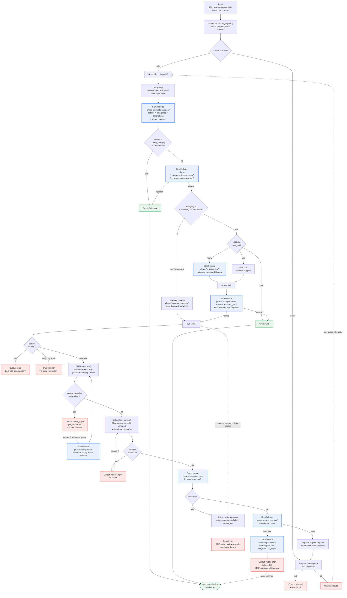
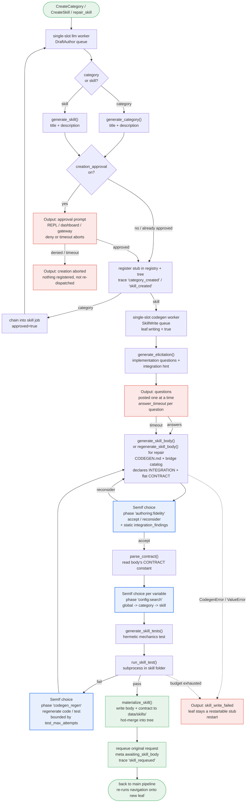

# Input → Output flow

How one input travels through the agent. Every diamond marked **SemIf** is a
real decision-engine call that is logged as a training row; the LLM only ever
*generates* (skill drafts, bodies, questions). There is no up-front
handle/ignore gate — every input is dispatched.

The diagram is split in two: the **main pipeline** (intake → navigation → run →
output) and the **authoring pipeline** (what happens when navigation decides a
category or skill does not exist yet). Authoring is asynchronous: the main gate
is freed immediately and the original request is re-queued once the body lands.

Rendered SVG: [flow-main.svg](flow-main.svg) · [flow-authoring.svg](flow-authoring.svg)

---

## Main pipeline

---

## Authoring pipeline (create / repair)

Entered from `CreateCategory`, `CreateSkill`, or a confirmed repair. Runs in
background single-slot workers so the main gate stays free.

---

## Reading the path

| Stage | Decision (SemIf) | Phase logged | Output |
| --- | --- | --- | --- |
| Intake, idle | — (no decision) | — | dispatch immediately |
| Intake, busy | — (no decision) | — | FIFO queue (arrival order) |
| Category | which category | `navigate:category` | category / create |
| Category scope | does it cover? | `navigate:category_scope` | descend / create |
| Canned | which reply | `navigate:response` | canned line |
| Leaf | which skill | `navigate:leaf` | skill |
| Intent guard | same action? | `navigate:intent` | run / create |
| Config record | record or ask? | `config:record` | persisted / per-fire |
| Outcome | did it succeed? | `assess:outcome` | ok / failed |
| Requeue | complete or retry? | `assess:requeue` | done / requeue |
| Repair | how to recover? | `repair:choice` | offer |
| Fidelity | real action? | `authoring:fidelity` | accept / rewrite |
| Config search | where is the value? | `config:search` | auto-populate |
| Test regen | code or test? | `codegen_regen` | regenerate |

**The three terminal outputs** are: a run summary (`category.skill: ok/failed — …`),
a question the run is waiting on (`needs_input`), or an offer to fix/learn
(`repair_offer`) / an authoring acknowledgement for a brand-new capability.
